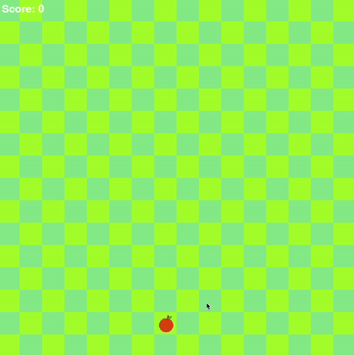

# Snake Game


This is a classic Snake game implemented using Pygame, where the player controls a snake to eat food, grow in length, and avoid colliding with the edges or itself.

## Features

- Smooth snake movement across a checkerboard background.
- Use of image assets for the snake's head, tail, and food.
- Dynamic score display on screen.
- Game over screen with option to restart.

## Installation

1. Make sure you have Python installed. 
2. Install Pygame by running:

   ```bash
   pip install pygame

   
